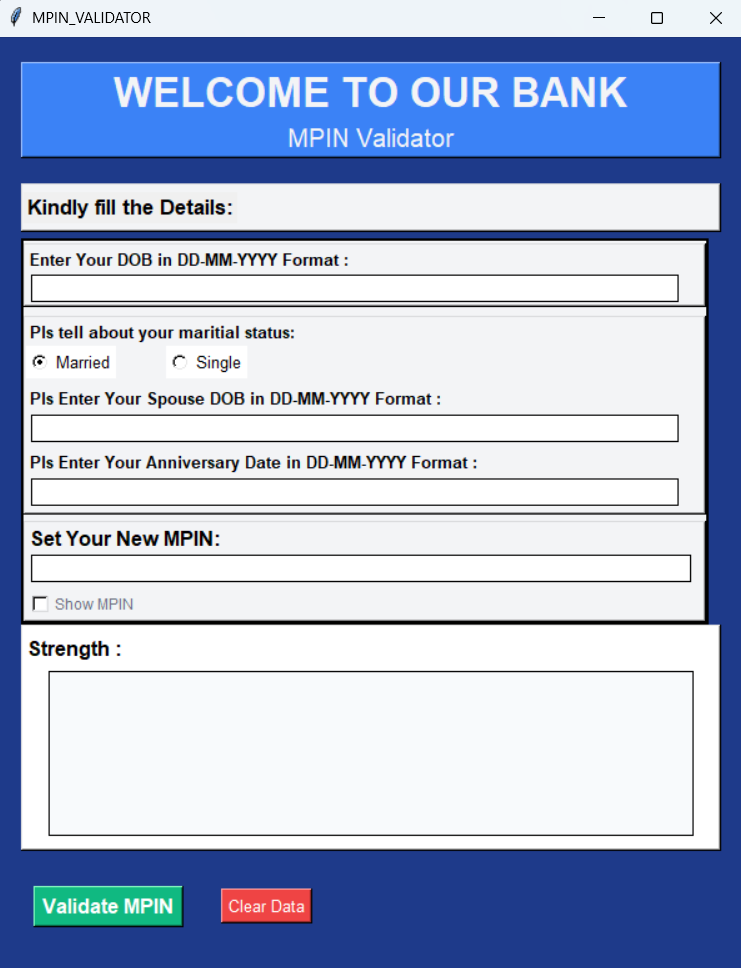

# 🔐 MPIN Strength Checker

A secure MPIN validation and strength checking system with a Tkinter GUI. Designed as part of an assignment for OneBanc, this app ensures users set non-guessable MPINs by avoiding common patterns and personal demographic data.

---

## 📌 Features

- GUI for interactive MPIN setup
- Validates both **4-digit and 6-digit MPINs**
- Rejects commonly used and predictable MPINs
- Checks against demographic info (DOB, spouse DOB, anniversary)
- Explains **why** an MPIN is considered **WEAK**
- Testable via `testcase.py` with 20+ scenarios
- Fully follows the **no hardcoded values** principle

---

## 📸 Screenshot



This is the MPIN setup screen built with Tkinter GUI.

## 🧠 MPIN Rules (From Task Requirements)

### ✅ Strength Criteria
An MPIN is considered **WEAK** if:
- It is a **commonly used pattern** (e.g., `1234`, `1111`, `1212`)
- It includes **user demographics** like:
  - Self DOB → e.g., `1406`, `2001`
  - Spouse DOB → e.g., `1207`, `1999`
  - Anniversary → e.g., `0912`, `2018`

### ✅ Output Structure:
For weak MPINs:
```python
Strength: WEAK
Reasons: ["COMMONLY_USED", "DEMOGRAPHIC_DOB_SELF"]
```
For strong MPINs:
```python
Strength: STRONG
Reasons: []
```

## 🚀 How to Run
### ✅ Prerequisites:
Python 3.x installed

▶️ Run via terminal:

# Clone the repository
git clone https://github.com/adityadorwal/MPIN-Strength-Checker.git
cd MPIN-Strength-Checker

# Run the application
python main.py
Or just run main.py after downloading as ZIP and extracting.

🧪 Test Coverage
✅ testcase.py includes at least 20 diverse test cases covering:

Strong vs. weak MPINs

All demographic checks

Both 4-digit and 6-digit inputs

Invalid or edge case inputs

📁 File Structure
MPIN-Strength-Checker/
│
├── main.py            # Launches GUI
├── checker.py         # MPIN strength logic (no hardcoding)
├── demographics.py    # Validates against user info
├── valid_dob.py       # DOB validation helpers
├── testcase.py        # Test suite
├── .gitignore         # Git hygiene
└── README.md          # This file
🏦 About the Task (OneBanc)
This assignment simulates a real-world mobile banking scenario where users often choose predictable MPINs. The app ensures higher security by validating against common patterns and user-specific demographics.

🔒 Goal: Help prevent guessable MPINs and encourage better mobile security practices.

👨‍💻 Author
Aditya Dorwal
GitHub: @adityadorwal
